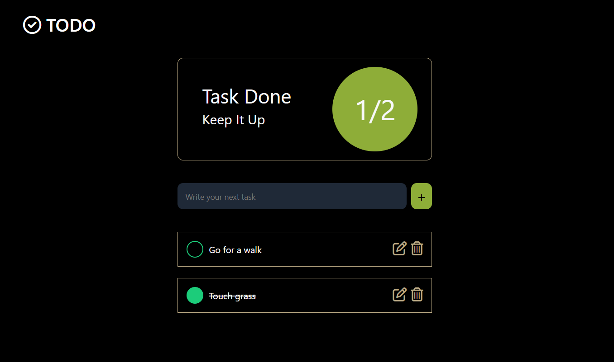

# Todo Web App

## Description
This is a simple and interactive To-Do Web App built using React. It allows users to add, remove, and mark tasks as completed, helping them organize their daily tasks efficiently.

## Features
- Add Tasks: Add new tasks to your to-do list.
- Mark Tasks as Completed: Track progress by marking tasks as completed.
- Delete Tasks: Remove tasks that are no longer needed.
- Responsive UI: Works well on both desktop and mobile devices.
- Persistent Storage: Tasks are saved to a database

## Technologies Used
- **Frontend**:  React (for building the user interface)
- **State Management** : React Hooks
- **Styling**: CSS, Bootstrap
- **Backend**:  SpringBoot
- **Database**:  Postgres
